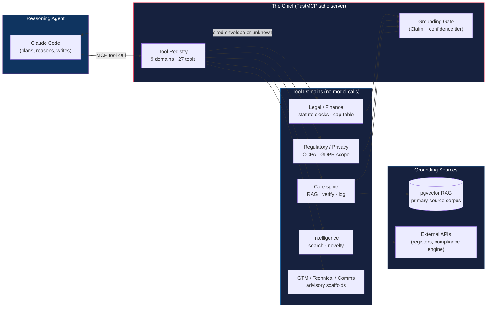

# AI Chief of Staff

> A citation-gated advisory MCP toolbelt that gives an AI coding agent grounded, source-backed tools across nine startup-operator domains, with a hard architectural rule that no tool may ever call a language model.

---

**This repository documents the architecture and design decisions for the AI Chief of Staff ("the Chief"). Source code is available on request.**

📄 [Portfolio](https://jamesshehan.dev) · 📬 [Request Source Access](mailto:james@jamesshehan.dev?subject=Source%20Access%20Request%20-%20AI%20Chief%20of%20Staff)

---

## Problem

Founders and solo operators face a constant stream of high-stakes, cross-domain questions: When is the 83(b) election deadline? Does this trigger a CCPA obligation? What does a new SAFE do to the cap table? Where does this land on a positioning canvas? A general AI assistant will answer all of them fluently, and some of the answers will be confidently wrong. For a legal clock or a tax threshold, a plausible hallucination is worse than no answer at all.

The need is an **operating partner an AI agent can consult**, where every legal or financial claim comes back tied to a verifiable primary source, or is explicitly marked unknown. Not another autonomous agent framework, but a disciplined, grounded toolbelt the reasoning agent can lean on without inheriting its tendency to make things up.

## Architecture

The Chief is deliberately **not** an autonomous orchestrator. The reasoning agent (Claude Code) is the brain; the Chief is a [FastMCP](https://github.com/jlowin/fastmcp) stdio server that exposes pure-data, pure-compute, and external-API tools returning **cited, structured results**. The load-bearing rule: **no tool may call a language model.** Every tool is deterministic or retrieval-only, so a model can never launder an unsourced claim through a "tool." The grounding burden stays where it can be enforced.

| Component | Function |
|-----------|----------|
| **FastMCP stdio server** | The tool surface Claude Code registers (`claude mcp add`). A second, in-process Agent-SDK server exists for tools that cannot be exposed over stdio; this reflects a real constraint of the MCP SDK. |
| **Tool registry (9 domains, 27 tools)** | Domain-modular `register_<domain>_tools` registration; a CI drift-guard asserts the exact tool surface so an accidental add or rename fails the build. |
| **Grounding gate (Output Contract)** | Every tool returns a frozen Pydantic `GroundedEnvelope` of `Claim`s, each carrying a 4-state confidence tier; a worst-tier rollup and a finalize gate block anything unsourced from being presented as grounded. |
| **pgvector RAG** | Retrieval over a primary-source corpus (statutes, regulatory text) so cited answers trace to real documents. |
| **External integrations** | Regulatory registers and an external production compliance engine (Ratify), reached through a circuit-breaker-guarded MCP client that degrades gracefully when the upstream is unavailable. |

## Tech Stack

| Technology | Role | Why This Choice |
|-----------|------|-----------------|
| Python 3.12 + uv | Language + tooling | Fast, reproducible installs; modern typing; `uv` lockfile for deterministic CI |
| FastMCP (stdio) | MCP server | Native stdio transport for Claude Code registration; minimal surface over the MCP protocol |
| Pydantic v2 (strict + frozen) | Output contract | Immutable, validated `Claim`/`GroundedEnvelope` types; strict mode forbids silent coercion |
| pgvector | Retrieval | Native Postgres vector search over the primary-source corpus, no separate vector DB |
| Voyage embeddings | Embeddings | High-retrieval-quality embeddings for legal and regulatory text |
| Supabase (Postgres) | Persistence | Durable state for discovery and novelty tracking; env-gated so the toolbelt runs offline on fixtures |
| Sentry + Langfuse | Observability | Exception tracking plus tool-call tracing |
| pytest + mypy (strict) + ruff | Quality gate | 560 tests, zero untyped code, lint-clean across ~220 files; structural invariants enforced in CI |

## Technical Challenges & Solutions

### 1. Stopping an AI From Laundering Hallucinations Through "Tools"

**Challenge**: The whole point of a grounded toolbelt collapses if a "tool" can quietly ask a model for an answer and return it as if it were sourced. Nothing in MCP prevents a tool author from importing an LLM SDK and doing exactly that.

**Solution**: A structural, CI-enforced invariant. `test_tools_no_model_call.py` enforces "no tool may call a language model" two ways. **Statically**, an AST scan walks every domain directory and the server entrypoint for any import or call into the model SDK, with an anchor-file coverage assertion so a mistyped path cannot make the test vacuously pass. **Dynamically**, every registered tool is invoked under a patched client that raises if the model SDK is touched at runtime. The rule is not a convention in a doc. It is a test that fails the build.

### 2. Citation-Gated Advisory Output (The Output Contract)

**Challenge**: Advisory answers (a tax deadline, a privacy obligation) are only safe if they are traceable. Free-form tool output invites unsourced assertions and gives the reasoning agent no machine-readable signal about how much to trust each claim.

**Solution**: A frozen Pydantic **Output Contract**. Every tool returns a `GroundedEnvelope` of `Claim` objects, each carrying a 4-state confidence tier (a pattern adapted from a production compliance system's tiering). The envelope computes a **worst-tier rollup**, so the whole answer is only as trustworthy as its weakest claim, and a **finalize gate** blocks shipping anything that fails grounding. The reasoning agent receives both the answer and an honest, structured confidence signal.

### 3. A Taxonomy of Grounding, Not Just "Cite Your Sources"

**Challenge**: "Ground everything" is too blunt. A pure-compute cap-table calculation grounds differently from a statute lookup, which grounds differently from a retrieval result. Conflating them produces either fake citations or unticketed gaps.

**Solution**: Four sanctioned grounding-metadata patterns, each documented and CI-checked: **emit-none** (pure compute, provenance is the deterministic function itself), **pass-through** (retrieval returns the source verbatim), **statute-derived Claims** (legal tools attach the controlling statute, and downgrade to honest-uncertainty when inputs are missing rather than asserting an exemption), and **static output-class provenance**. Legal tools never assert a favorable conclusion on unknown inputs. They say so.

### 4. Novelty Detection for an Intelligence Feed

**Challenge**: A monitoring tool that re-surfaces the same regulatory change every run is noise. Deduping on URL alone misses edits; deduping on full content misses near-duplicates.

**Solution**: Fingerprint-per-cited-fact. Each surfaced item is keyed by `(source_url, content_hash)` against a durable seen-state store (a `Protocol`-backed interface with an in-memory implementation for tests and a Supabase implementation in production, env-gated). The store degrades gracefully to in-memory when the backend is unreachable, and an SSRF guard (no redirects, internal-host blocking, response-size cap) protects the fetch path.

## Key Decisions

| Decision | Choice | Rationale |
|---------|--------|-----------|
| Brain / tools separation | Claude Code reasons; tools only return cited data | Keeps the grounding burden in deterministic code, not in a model that can hallucinate |
| No-model-call invariant | AST scan plus runtime bomb in CI | A "tool" can never launder an unsourced model answer as grounded |
| Two MCP surfaces | stdio server plus in-process Agent-SDK server | Some tools cannot be exposed over `claude mcp add` stdio; the split respects a real MCP SDK constraint |
| Frozen Output Contract | Pydantic strict + frozen `Claim`/`GroundedEnvelope`, worst-tier rollup, finalize gate | Immutable, auditable, honest per-claim confidence |
| Domain-modular registration | `register_<domain>_tools` plus exact-surface CI drift-guard | 9 domains evolve independently; the tool surface cannot drift silently |

See [docs/tech-decisions.md](docs/tech-decisions.md) for detailed excerpts.

## Results

- **27 MCP tools across 9 domains**: core spine, legal/corporate, compliance-engine integration, intelligence, finance/cap-table, technical, GTM, regulatory/privacy, and comms
- **560 pytest tests**, **mypy strict** (zero untyped code), **ruff** clean across ~220 source files
- **Zero language-model calls inside any tool**, enforced by an AST scan *and* a runtime guard in CI
- **4 sanctioned grounding-metadata patterns**, each CI-enforced
- **Frozen Pydantic Output Contract** with a 4-state confidence tier and worst-tier rollup
- **Graceful degradation** throughout: env-gated live paths, circuit-breaker on the external compliance engine, in-memory fallback for the discovery store, SSRF-guarded fetch

## Project Status

| Phase | Status | Description |
|-------|--------|-------------|
| P0-P1: Spine | ✅ | Scaffold, grounding spine, pgvector RAG, Output Contract, no-model-call invariant |
| P2: Core toolbelt | ✅ | Legal/corporate, compliance-engine integration, intelligence, finance |
| Wave-3: Breadth | ✅ | Regulatory/privacy, GTM, technical, comms domains (5-domain expansion) |
| P3-D: Discovery | ✅ | Novelty-detection engine plus worker-classification tool (27 tools) |
| P4: Live engine | 🚧 | Replace the mock compliance-engine client with the live MCP integration |

---

**Built by [James Shehan](https://jamesshehan.dev)** · TPM / Solutions Architect

📬 [Request source access](mailto:james@jamesshehan.dev?subject=Source%20Access%20Request%20-%20AI%20Chief%20of%20Staff)
